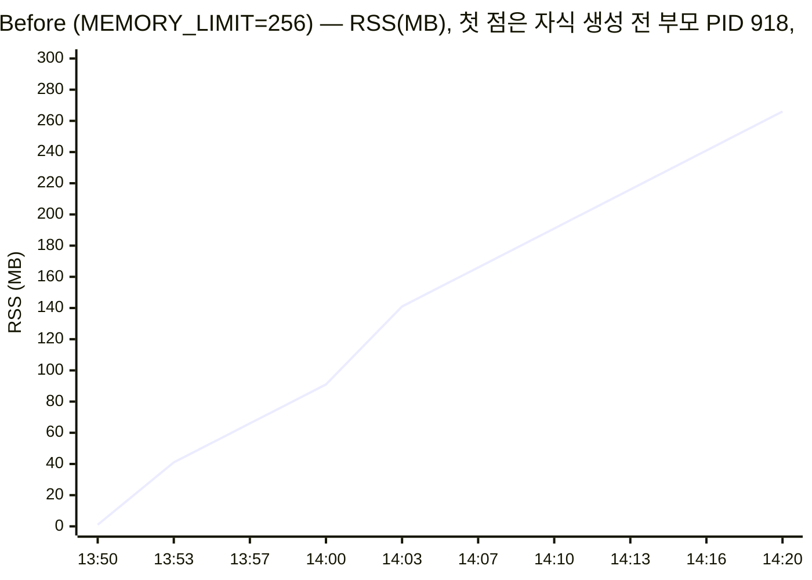
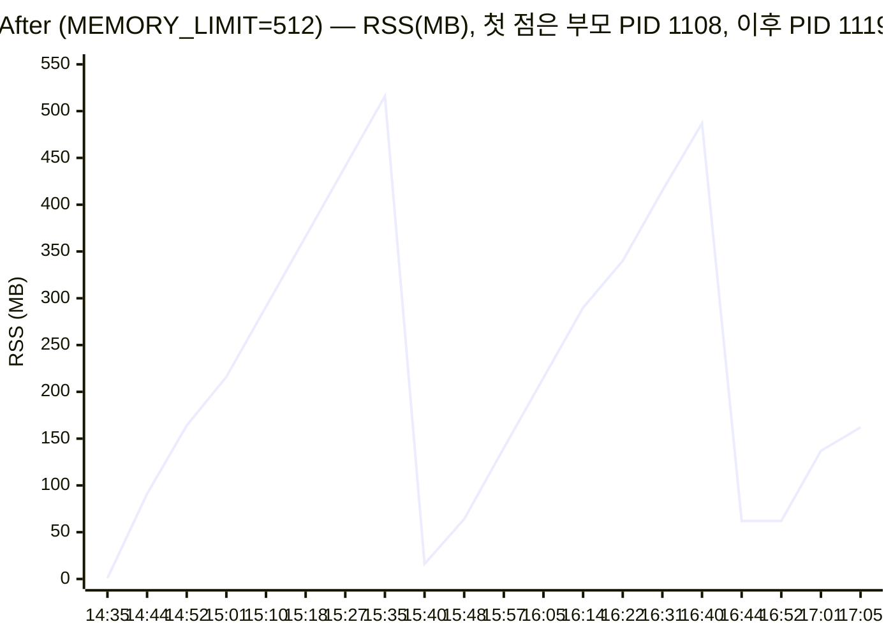

# [Bug] OOM Crash - 실행 33초 만에 Heap이 MEMORY_LIMIT(256MB)을 넘어 MemoryGuard가 프로세스를 SIGKILL로 자가 종료

| 항목 | 값 |
|---|---|
| 대상 | `agent-leak-app-arm64` (PyInstaller 부모 PID 918 → 실제 작업 자식 **PID 930**) |
| 환경 | Ubuntu 24.04 aarch64 컨테이너, 10 vCPU / 8GB, 실행 계정 `agent`(uid 1001) |
| 발생 조건 | `MEMORY_LIMIT=256`, `CPU_MAX_OCCUPY=50`, `MULTI_THREAD_ENABLE=false` |
| 발생 시각 | 2026-10-06 20:14:23 UTC (실행 시작 20:13:50) |
| 원본 증거 | [`evidence/oom/before/`](../evidence/oom/before), [`evidence/oom/after/`](../evidence/oom/after) |

## 1. Description (현상 설명)

`agent-leak-app`을 `MEMORY_LIMIT=256`으로 실행하면 부트 시퀀스(6/6 OK)는 정상 통과하지만, **실행 33초 뒤 아무 오류 출력 없이 프로세스가 사라진다.** 셸에 돌아온 종료 코드는 `137`이다.

- 언제: 실행 직후부터 `[MemoryWorker] Current Heap`이 약 3초마다 25MB씩 증가했고, 275MB가 되는 시점(실행 33초)에 종료됐다.
- 어떤 조건에서: 시작 배너가 이미 `[ MEMORY ] Limit: 256MB [ WARNING: Recommend Over 256MB ]`로 경고하고 있었다. CPU와 스레드 설정은 정상값(50%, false)이므로 메모리 외 요인은 배제된다.
- 재현성: `MEMORY_LIMIT=256`으로 3회 실행했다(정찰 2회 중 1회는 `CPU_MAX_OCCUPY=80`, 본 측정 1회). 3회 모두 시작 약 33초 뒤 같은 `MemoryGuard` 로그로 종료됐고, 종료 코드를 기록한 2회는 모두 `EXIT:137`이었다 ([`evidence/recon/notes.md`](../evidence/recon/notes.md)).

## 2. Evidence & Logs (증거 자료)

### 2-1. monitor.sh 관제 로그: RSS 선형 증가 ([monitor.log](../evidence/oom/before/monitor.log), 약 3초 간격)

```
[2026-10-06 20:13:50] PROCESS:agent-leak-app PID:918 CPU:0% MEM:0.0% RSS:1MB THREADS:1 STAT:S DISK:415G FIREWALL:n/a     ← 부모(부트로더)만 존재
[2026-10-06 20:13:53] PROCESS:agent-leak-app PID:930 CPU:0% MEM:0.5% RSS:41MB THREADS:1 STAT:SN DISK:415G FIREWALL:n/a
[2026-10-06 20:14:00] PROCESS:agent-leak-app PID:930 CPU:0% MEM:1.1% RSS:91MB THREADS:1 STAT:SN DISK:415G FIREWALL:n/a
[2026-10-06 20:14:07] PROCESS:agent-leak-app PID:930 CPU:1% MEM:2.0% RSS:166MB THREADS:1 STAT:SN DISK:415G FIREWALL:n/a
[2026-10-06 20:14:13] PROCESS:agent-leak-app PID:930 CPU:1% MEM:2.7% RSS:216MB THREADS:1 STAT:SN DISK:415G FIREWALL:n/a
[2026-10-06 20:14:20] PROCESS:agent-leak-app PID:930 CPU:0% MEM:3.3% RSS:266MB THREADS:1 STAT:SN DISK:415G FIREWALL:n/a
```



- 마지막 샘플(20:14:20) 3초 뒤인 20:14:23에 프로세스가 종료돼 관제가 끝났다([run.txt](../evidence/oom/before/run.txt)).
- RSS는 **약 3.3초마다 25MB씩 한 번도 줄지 않고 증가**했다. 해제가 전혀 없는 선형 증가로, 누수의 전형적인 모양이다.
- CPU는 0~1%로 안정적이었다. 연산 부하가 아니라 메모리 적재만 늘어난 것이다.
- `MEM%`는 3.3%로 작게 보인다. 분모가 VM 전체 메모리 8GB이기 때문이며, 그래서 판단은 RSS(MB)를 `MEMORY_LIMIT`과 직접 비교해서 했다.

### 2-2. 프로그램 실행 로그 핵심 구간 ([app.log](../evidence/oom/before/app.log))

```
 [ MEMORY ] Limit: 256MB 		[ WARNING: Recommend Over 256MB ]
2026-10-06 20:13:50,713 [INFO] [SafetyGuard] Process priority lowered (nice=10).
2026-10-06 20:13:52,738 [INFO] [MemoryWorker] Current Heap: 25MB
...
2026-10-06 20:14:20,011 [INFO] [MemoryWorker] Current Heap: 250MB
2026-10-06 20:14:23,045 [INFO] [MemoryWorker] Current Heap: 275MB
2026-10-06 20:14:23,046 [CRITICAL] [MemoryGuard] Memory limit exceeded (275MB >= 256MB) / (Recommend Over 256MB)
2026-10-06 20:14:23,046 [CRITICAL] [MemoryGuard] Self-terminating process 930 to prevent system instability.
```
```
START 2026-10-06 20:13:50
END 2026-10-06 20:14:23 EXIT:137 SURVIVED:33s        ← run.txt
```

- 로그 속 `Self-terminating process 930`의 PID가 관제 대상 PID 930과 같다. 관제한 프로세스가 바로 자가 종료된 프로세스라는 뜻이다.
- 이 빌드는 미션 예시에 나온 `>>> [SYSTEM] SELF-TERMINATED <<<` 배너를 출력하지 않는다. 대신 `[CRITICAL] [MemoryGuard]` 두 줄과 종료 코드 137이 같은 사실을 보여 준다.
- 같은 로그가 `$AGENT_LOG_DIR/agent_app.log`에도 기록된다. 내용이 app.log와 같아 따로 보관하지 않았다.

### 2-3. 시스템 도구 출력 (종료 11초 전, [ps.txt](../evidence/oom/before/ps.txt))

```
2026-10-06 20:14:12
    PID    PPID USER     STAT  NI %CPU %MEM   RSS    VSZ     ELAPSED CMD
    918     903 agent    S      0  0.2  0.0  1828   2800       00:22 ./agent-leak-app-arm64
    930     918 agent    SN    10  0.5  2.3 196232 201520      00:22 ./agent-leak-app-arm64
VmRSS:	  196232 kB      VmHWM: 196232 kB (최고점 = 현재값 → 한 번도 줄어든 적 없음)
```

- 프로세스가 2개인 이유는 PyInstaller onefile 구조 때문이다. 부모 918은 압축을 풀고 자식을 띄우기만 하는 부트로더로 RSS가 1.8MB이고, 실제 Python 코드는 자식 930(`NI 10`, `STAT SN`)이 실행한다. 부모를 관제했다면 메모리가 평평하게 보였을 것이다.
- `VmHWM`(최대 RSS)과 `VmRSS`(현재 RSS)가 같다. 메모리가 한 번도 반환되지 않았다는 뜻이다.

## 3. Root Cause Analysis (원인 분석)

**결론: 애플리케이션의 MemoryWorker가 힙에 데이터를 계속 쌓기만 하고 해제하지 않는 메모리 누수 결함이 있다. RSS가 `MEMORY_LIMIT`을 넘는 순간 앱 내부의 MemoryGuard가 시스템 보호를 위해 자기 프로세스에 SIGKILL을 보냈다.**

1. **누수 판단 근거**: RSS가 시간에 비례해 단조 증가했고(25MB/3초), `VmHWM == VmRSS`, CPU는 1% 이하였다. 계산이 많아서 메모리를 쓰는 것이 아니라, 만든 객체를 가리키는 참조가 계속 남아 있어서 GC가 회수하지 못하는 상황이다. 예를 들어 전역 리스트나 캐시에 append만 하는 경우가 이렇다.
   - 대조군: 512MB에서는 앱이 다른 시나리오(`Scenario Selected: [Healthy System Monitoring]`)를 고르고, 그 시나리오의 MemoryWorker는 한도에 닿으면 `Memory Cache Flushed`로 캐시를 비워 실제 RSS가 516MB에서 16MB로 떨어진다(4절). 256MB(누수 시나리오)에서는 회수 시도 로그 없이 한도를 넘은 첫 샘플(275MB)에서 바로 Guard가 종료했다. 즉 같은 "한도 도달"이 시나리오에 따라 종료와 회수로 갈린다.
2. **누가 죽였는가 (커널 OOM Killer와 구분)**:
   - 컨테이너 메모리는 8GB이고 사용량은 266MB였으므로 커널 OOM 조건이 아니다.
   - 종료 직전 로그가 `[MemoryGuard] Self-terminating process 930`이다. 애플리케이션이 스스로 종료를 결정했다.
   - 종료 코드 `137 = 128 + 9` → **SIGKILL**. 정리(cleanup) 핸들러를 실행할 수 없는 즉시 종료다.
3. **관련 OS 동작 원리**:
   - 프로세스의 가상 메모리는 Code / Data / **Heap** / Stack 영역으로 나뉜다. Python 객체는 힙에 잡히고, 실제로 접근한 페이지만 물리 메모리에 올라가 **RSS(Resident Set Size)**로 집계된다. VSZ(201MB)와 RSS(196MB)가 거의 같다는 것은 할당한 메모리를 실제로 다 쓰고 있다는 뜻이다.
   - 누수가 계속되면 시스템 전체에 영향이 간다. 가용 메모리가 줄면 커널은 먼저 페이지 캐시를 비워 다른 프로세스의 I/O가 느려지고, 그다음 스왑을 써서 응답이 급격히 느려지며(thrashing), 끝내는 **커널 OOM Killer**가 `oom_score`가 높은 프로세스를 고른다. 이때 누수와 무관한 DB 같은 핵심 프로세스가 대신 죽을 수도 있다.
   - MemoryGuard가 커널보다 **먼저, 자기 자신만** 종료하는 이유가 여기에 있다. 피해 범위를 누수한 프로세스 하나로 한정하고, 로그를 남겨 원인을 추적할 수 있게 하려는 것이다. 즉 MemoryGuard는 장애를 일으킨 주체가 아니라 장애를 국소화하는 장치다.

## 4. Workaround & Verification (조치 및 검증)

### 조치
`MEMORY_LIMIT`을 **256 → 512**로 상향했다. 다른 변수는 그대로 두었다(`CPU_MAX_OCCUPY=50`, `MULTI_THREAD_ENABLE=false`).
```bash
# 운영 환경이라면 ~/.bash_profile 의 export 값을 수정. 본 재현은 실행 시 덮어쓰기:
CASE=oom TAG=after MEMORY_LIMIT=512 CPU_MAX_OCCUPY=50 MULTI_THREAD_ENABLE=false MON_INTERVAL=3 scripts/run.sh
```

### Before & After

| 구분 | MEMORY_LIMIT | 종료 여부 | 생존 시간 | 종료 코드 | 최대 RSS | 핵심 로그 |
|---|---|---|---|---|---|---|
| Before | 256MB | **강제 종료** | **33s** | 137 (SIGKILL) | 266MB (계속 증가) | `[MemoryGuard] Memory limit exceeded (275MB >= 256MB)` |
| After | 512MB | **생존** | **153s+** (관찰을 끝내려고 수동 SIGTERM) | 143 (수동 종료) | 516MB → 16MB로 회수 | `Memory Cache Flushed. Process Stabilized.` ×2 |



After 실행 로그 ([app.log](../evidence/oom/after/app.log)):
```
2026-10-06 20:15:39,683 [INFO] [MemoryWorker] Current Heap: 525MB
2026-10-06 20:15:39,683 [WARNING] [MemoryWorker] Memory Usage Reached Limit (525MB). Starting cleanup...
2026-10-06 20:15:39,702 [INFO] [System] Memory Cache Flushed. Process Stabilized.
>>> [SYSTEM] MEMORY RECOVERED (Cache Cleared) <<<
2026-10-06 20:16:45,379 [WARNING] [MemoryWorker] Memory Usage Reached Limit (525MB). Starting cleanup...
2026-10-06 20:16:45,400 [INFO] [System] Memory Cache Flushed. Process Stabilized.
```

**검증 결과**: 한도를 올리자 생존 시간이 33초에서 153초 이상으로 늘었다. 다만 After 로그를 보면 이 설정에서는 앱이 **Healthy 시나리오를 선택**했다(`evidence/oom/after/app.log:30`). 즉 한도 상향은 같은 누수 코드를 오래 버티게 한 것이 아니라, 배너 권고(`Recommend Over 256MB`)를 충족해 누수 시나리오 자체를 벗어나게 한 조치다. 관찰하는 동안 강제 종료는 한 번도 없었다. 한도에 도달할 때마다 회수가 동작해 RSS가 약 66초 주기의 톱니 모양으로 안정됐다.

### 한계와 근본 해결 제안
- 한도 상향은 **종료 시점을 늦추거나 회수 경로로 우회시킬 뿐**, 누수 코드는 그대로다. 더 많이 쌓이는 입력이 들어오면 512MB도 넘을 수 있다.
- 코드 수정 제안:
  1. 누적 컬렉션에 **상한을 두고 LRU로 축출**한다(예: `functools.lru_cache(maxsize=…)`, `collections.deque(maxlen=…)`).
  2. 처리가 끝난 데이터는 참조를 끊어(`del`, `pop`) GC 대상이 되게 한다. 한도 도달 시에만 비우는 것이 아니라 **주기적으로** 해제한다.
  3. `tracemalloc` 스냅샷 비교로 누수 지점(파일:줄)을 특정한다.
- 운영 제안: `monitor.sh`에 **RSS 증가 기울기(MB/분) 경보**를 추가해 한도에 닿기 전에 탐지하고, 컨테이너 수준 `--memory` 제한과 함께 운영한다.
