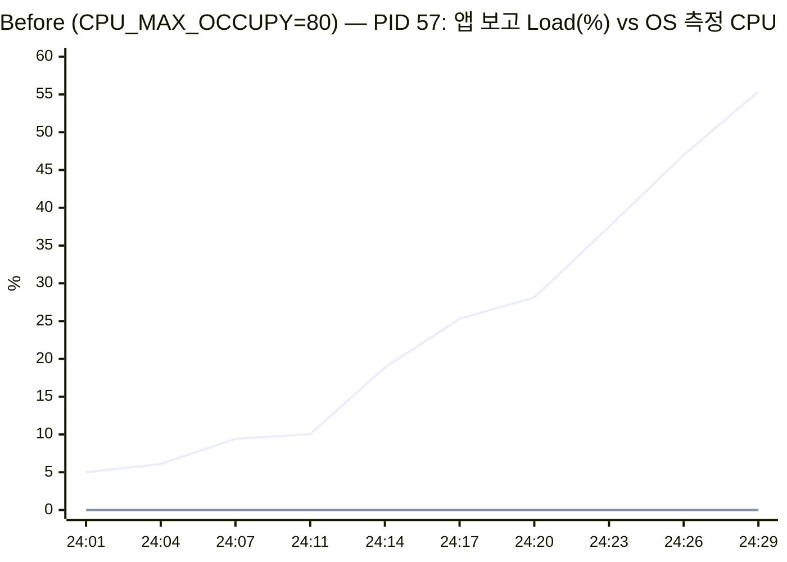
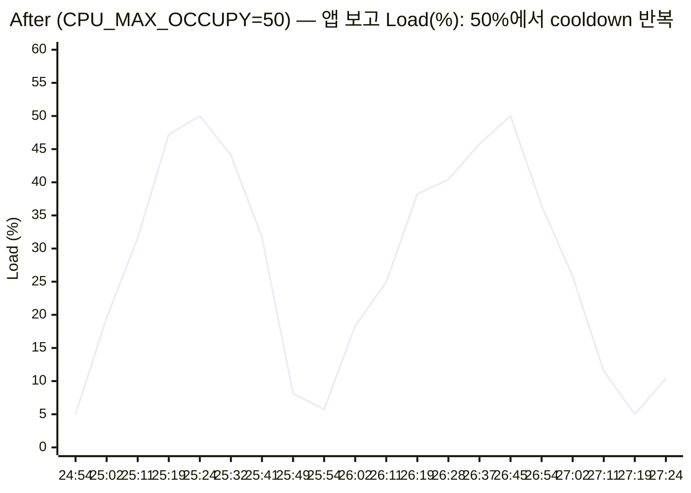

# [Bug] CPU Latency - CpuWorker 부하가 Watchdog 임계(50%)를 넘어 실행 30초 만에 SIGTERM으로 종료

| 항목 | 값 |
|---|---|
| 대상 | `agent-leak-app-arm64` (부모 PID 33 → 실제 작업 자식 **PID 57**) |
| 환경 | Ubuntu 24.04 aarch64 컨테이너, 10 vCPU / 8GB, 실행 계정 `agent`(uid 1001) |
| 발생 조건 | `CPU_MAX_OCCUPY=80`, `MEMORY_LIMIT=512`, `MULTI_THREAD_ENABLE=false` |
| 발생 시각 | 2026-10-06 20:24:29 UTC (실행 시작 20:23:59) |
| 원본 증거 | [`evidence/cpu/before/`](../evidence/cpu/before), [`evidence/cpu/after/`](../evidence/cpu/after), [`evidence/cpu/probe-1core/`](../evidence/cpu/probe-1core) |

## 1. Description (현상 설명)

`CPU_MAX_OCCUPY=80`으로 실행하면 부트 시퀀스(6/6 OK)는 통과한다. 그 뒤 `[CpuWorker]`가 보고하는 부하가 3초마다 계속 오르다가, **실행 30초 뒤 `CPU Threshold Violated!` 로그를 남기고 프로세스가 종료된다.** 종료 코드는 `143`이다.

- 언제: 부하가 5.00%에서 시작해 55.39%가 된 시점(실행 30초)에 종료됐다.
- 어떤 조건에서: 시작 배너가 `[ CPU ] Limit: 80% [ WARNING: Recommend Under 50% ]`로 경고했다. 메모리(512MB)와 스레드(false)는 정상값이라 다른 요인은 배제된다.
- 재현성: 같은 설정으로 4회 실행(정찰 2회, 1코어 검증 1회, 본 측정 1회)했고 모두 30~34초에 `EXIT:143`으로 같았다 ([`evidence/recon/notes.md`](../evidence/recon/notes.md)).

## 2. Evidence & Logs (증거 자료)

### 2-1. monitor.sh 관제 로그 ([monitor.log](../evidence/cpu/before/monitor.log))

`monitor.sh`는 같은 시점의 두 지표를 함께 기록한다. 하나는 `top`이 1초 동안 잰 OS 측정 CPU(`CPU:`)이고, 다른 하나는 앱 로그에 찍힌 마지막 `Current Load` 값(`APP_LOAD:`)이다.

```
[2026-10-06 20:24:01] PROCESS:agent-leak-app PID:57 CPU:0% MEM:0.2% RSS:16MB THREADS:1 STAT:SN APP_LOAD:5.00%  ...
[2026-10-06 20:24:08] PROCESS:agent-leak-app PID:57 CPU:0% ... APP_LOAD:9.42%
[2026-10-06 20:24:14] PROCESS:agent-leak-app PID:57 CPU:0% ... APP_LOAD:18.86%
[2026-10-06 20:24:21] PROCESS:agent-leak-app PID:57 CPU:0% ... APP_LOAD:28.13%
[2026-10-06 20:24:24] PROCESS:agent-leak-app PID:57 CPU:0% ... APP_LOAD:37.48%
[2026-10-06 20:24:28] PROCESS:agent-leak-app PID:57 CPU:0% ... APP_LOAD:46.99%
[2026-10-06 20:24:31] PROCESS:agent-leak-app PID:- STATUS:NOT_RUNNING APP_LOAD:55.39%   ← 종료
```


(위 선은 앱 로그의 `Current Load`이고, 아래 선은 같은 시각 `top`이 잰 %CPU다.)

### 2-2. 프로그램 실행 로그 핵심 구간 ([app.log](../evidence/cpu/before/app.log))

```
 [ CPU    ] Limit: 80%  		[ WARNING: Recommend Under 50% ]
2026-10-06 20:23:59,701 [INFO] [SafetyGuard] Process priority lowered (nice=10).
2026-10-06 20:24:01,713 [INFO] [CpuWorker] Started. Maximum CPU Limit: 80%
2026-10-06 20:24:01,713 [INFO] [CpuWorker] Current Load: 5.00%
2026-10-06 20:24:14,216 [INFO] [CpuWorker] Current Load: 18.86%
2026-10-06 20:24:23,582 [INFO] [CpuWorker] Current Load: 37.48%
2026-10-06 20:24:26,710 [INFO] [CpuWorker] Current Load: 46.99%
2026-10-06 20:24:29,842 [INFO] [CpuWorker] Current Load: 55.39%
2026-10-06 20:24:29,948 [CRITICAL] [CpuWorker] CPU Threshold Violated! (55.38999999999999%).
```
```
START 2026-10-06 20:23:59
END 2026-10-06 20:24:29 EXIT:143 SURVIVED:30s        ← run.txt
```

- 앱 로그에서 읽히는 판정 기준은 세 가지다.
  1. 위반 시점의 부하는 **55.39%**로, 설정한 상한 80%보다 낮다.
  2. 배너는 `Recommend Under 50%`라고 권고한다.
  3. 같은 앱에서 `CPU_MAX_OCCUPY=50`이면 50.00%에서 멈춘다(4절).
  
  따라서 Watchdog의 임계는 **50%로 고정**돼 있고, `CPU_MAX_OCCUPY`는 워커가 부하를 끌어올릴 수 있는 **상한**이다. 상한이 임계보다 높으면 위반이 반드시 일어난다.
- 종료 코드 `143 = 128 + 15` → **SIGTERM**. 오류로 인한 크래시였다면 Python 예외 트레이스백과 종료 코드 1이 나오거나, SIGSEGV로 139가 나왔을 것이다. 여기서는 정책 위반 로그 바로 뒤에 SIGTERM으로 종료됐으므로 **오류가 아니라 Watchdog의 보호 조치**다.
- 이 빌드는 미션 예시의 `WATCHDOG: INITIATING EMERGENCY ABORT (SIGTERM)` 문구를 출력하지 않는다. 대신 `[CRITICAL] ... CPU Threshold Violated!` 줄과 종료 코드 143이 같은 사실을 보여 준다.

### 2-3. 시스템 도구 출력: "시스템 전체 부하가 아니다" ([top.txt](../evidence/cpu/before/top.txt), [ps.txt](../evidence/cpu/before/ps.txt), [cgroup.txt](../evidence/cpu/before/cgroup.txt))

```
top - 20:24:27 up 19 min,  0 user,  load average: 0.26, 0.14, 0.04
%Cpu(s):  0.0 us,  0.0 sy,  0.0 ni,100.0 id,  0.0 wa,  0.0 hi,  0.0 si,  0.0 st
### top -H -p 57 (스레드별)
    PID USER      PR  NI    VIRT    RES    SHR S  %CPU  %MEM     TIME+ COMMAND
     57 agent     30  10   23316  17048   8596 S   0.0   0.2   0:00.23 agent-l+

    PID    PPID STAT  NI %CPU %MEM     ELAPSED     TIME COMMAND
     57      33 SN    10  0.7  0.2       00:29 00:00:00 agent-leak-app-

[2026-10-06 20:24:02] CGROUP_CPU:4%  ...  [2026-10-06 20:24:29] CGROUP_CPU:5%   (컨테이너 전체, 관제 도구 포함)
```

- `load average 0.26`, `%Cpu(s) 100.0 id`로 시스템 전체는 한가했다. 장애의 원인은 시스템 전체 부하가 아니라 PID 57 한 프로세스의 정책 위반이다.
- 의외의 발견: 앱이 55%라고 보고한 순간에도 OS가 잰 PID 57의 CPU는 0%였고, 누적 CPU 시간(`TIME+`)은 29초 동안 0.23초뿐이었다. 컨테이너 전체 사용량(cgroup `cpu.stat`)도 5% 이하였다.
  - 혹시 코어가 10개라 부하가 분산돼 묽어진 것인지 확인하려고, 1코어(`--cpuset-cpus 0`)로 다시 실행했다. 결과는 CPU 0% 그대로였다 ([probe-1core](../evidence/cpu/probe-1core/monitor.log)).
  - 결론: `CpuWorker`의 "Current Load"는 실제 연산량이 아니라 **앱이 스스로 계산해 보고하는 부하 지표**이고, Watchdog은 이 앱 내부 지표로 판정한다. 그래서 이 장애를 식별할 1차 근거는 앱 로그와, 이를 함께 수집하는 관제(`APP_LOAD`)다. `top`/`ps`는 시스템 전체 부하가 아니라는 사실을 확인하는 데 썼다.

## 3. Root Cause Analysis (원인 분석)

**결론: `CPU_MAX_OCCUPY=80`은 CpuWorker가 부하를 80%까지 올려도 된다고 허용하는 설정이다. 그런데 Watchdog의 보호 임계는 50%로 고정돼 있어서, 부하가 선형으로 오르다 50%를 넘는 순간 Watchdog이 프로세스에 SIGTERM을 보냈다. 설정 상한(80) > 보호 임계(50)라는 설정 불일치가 원인이다.**

1. **동작 흐름**: 부하가 3.1초마다 약 5%p씩 오른다 → 50%를 넘는다(55.39%) → `CPU Threshold Violated!` 로그 → 약 0.1초 뒤 SIGTERM으로 종료.
2. **CPU 과점유가 시스템 지연을 일으키는 원리** (실제 운영에서 이 지표가 실제 CPU 사용량이라면):
   - 리눅스 CFS 스케줄러는 실행 가능한(Runnable) 태스크들에 가중치(nice 값)에 비례해 CPU 시간을 나눠 준다. 한 프로세스가 busy loop처럼 쉬지 않고 연산하면 늘 런큐에 올라 있어 자기 몫의 타임슬라이스를 매번 다 쓴다.
   - 그러면 같은 코어의 다른 태스크는 런큐에서 대기하는 시간이 길어지고, 웹 요청 처리나 헬스체크 같은 짧은 작업의 응답 지연(latency)이 늘어난다. 코어 수보다 Runnable 태스크가 많아지면 load average가 올라가고, 컨텍스트 스위칭 비용까지 더해진다.
   - 그래서 장애 유형 이름이 "CPU Latency"다. 프로세스 자신은 바쁘게 돌고 있어도, 주변 서비스가 **느려지는** 형태로 장애가 드러난다.
3. **보호 장치가 두 겹이다**:
   - `SafetyGuard`가 부팅 직후 자기 `nice`를 10으로 낮춘다(`NI 10`, `PR 30`, `STAT SN`). CFS 가중치가 1024(nice 0)에서 110(nice 10)으로 줄어, 경쟁이 생기면 다른 nice 0 프로세스보다 약 9배 적은 CPU를 받는다. 과점유하더라도 남에게 양보하게 만드는 1차 완화책이다.
   - `Watchdog`은 임계를 넘으면 프로세스를 끝낸다. 2차 차단책이다.
4. **왜 하나를 죽이는 것이 시스템 보호인가**: 과점유가 길어지면 같은 호스트의 모든 서비스가 느려지는 연쇄 장애로 번진다. 원인 프로세스 하나를 끝내면 CPU가 즉시 다른 태스크에 돌아가고, 프로세스는 supervisor(systemd 등)가 다시 띄울 수 있다. 그리고 SIGKILL이 아니라 **SIGTERM**을 쓰는 이유는 종료 전에 정리 핸들러(로그 flush, 연결 종료)를 실행할 기회를 주기 위해서다. 메모리 누수 때는 SIGKILL(137)을 쓴 것과 대비된다. 메모리는 정리 중에도 더 늘어날 수 있어 즉시 끊는 편이 안전하지만, CPU 과점유는 잠깐 정리할 시간을 줘도 위험이 크지 않다.

## 4. Workaround & Verification (조치 및 검증)

### 조치
`CPU_MAX_OCCUPY`를 **80 → 50**으로 하향해 워커 상한을 Watchdog 임계 이하로 맞췄다.
```bash
CASE=cpu TAG=after CPU_MAX_OCCUPY=50 MEMORY_LIMIT=512 MULTI_THREAD_ENABLE=false MON_INTERVAL=3 scripts/run.sh
```

### Before & After

| 구분 | CPU_MAX_OCCUPY | 종료 여부 | 생존 시간 | 종료 코드 | 최대 부하(앱 보고) | 핵심 로그 |
|---|---|---|---|---|---|---|
| Before | 80% | **Watchdog 종료** | **30s** | 143 (SIGTERM) | 55.39% (임계 초과) | `CPU Threshold Violated! (55.38…%)` |
| After | 50% | **생존** | **155s+** (관찰을 끝내려고 수동 SIGTERM) | 143 (수동 종료) | 50.00%에서 멈춤 | `Peak reached (50.00%). Starting cooldown...` ×2 |



After 실행 로그 ([app.log](../evidence/cpu/after/app.log)):
```
2026-10-06 20:24:53,134 [INFO] [CpuWorker] Started. Maximum CPU Limit: 50%
2026-10-06 20:25:23,390 [INFO] [CpuWorker] Peak reached (50.00%). Starting cooldown...
2026-10-06 20:25:54,659 [INFO] [CpuWorker] Cooldown complete (5.00%). Resuming load increase...
2026-10-06 20:26:44,692 [INFO] [CpuWorker] Peak reached (50.00%). Starting cooldown...
2026-10-06 20:27:19,080 [INFO] [CpuWorker] Cooldown complete (5.00%). Resuming load increase...
```

**검증 결과**: 상한을 임계 이하로 낮추자 부하가 50.00%에서 멈추고 스스로 내려가는 사이클(약 80초 주기)이 2번 반복됐다. 155초 동안 `Threshold Violated`는 한 번도 나오지 않았다. 생존 시간은 30초에서 155초 이상으로 늘었다.

### 한계와 근본 해결 제안
- 상한 하향은 **부하를 억제할 뿐 작업량 자체를 줄이지 않는다**. 실제 CPU-bound 작업이라면 처리량이 그만큼 떨어진다.
- 코드 수정 제안:
  1. 부하를 만드는 루프를 **작은 단위로 쪼개 중간에 `sleep`/yield**를 넣는다. 또는 작업 큐로 바꿔 동시 처리량을 제한한다.
  2. 설정 검증 단계에서 `CPU_MAX_OCCUPY > Watchdog 임계`이면 부팅을 실패시키거나 값을 잘라낸다(clamp). 이번 장애는 **설정 불일치**가 본질이므로 부팅 단계에서 막는 것이 가장 싸다.
  3. 앱 내부 지표와 OS 측정값(`/proc/PID/stat`의 utime)을 함께 보고해, 두 값이 크게 다를 때 경고한다.
- 운영 제안: 프로세스 단위 CPU 상한은 앱 내부 정책보다 OS 기능인 **cgroup `cpu.max`**(`docker run --cpus`, systemd `CPUQuota=`)로 강제하는 것이 확실하다. 이렇게 하면 프로세스를 죽이지 않고 스로틀링만 할 수 있다.
