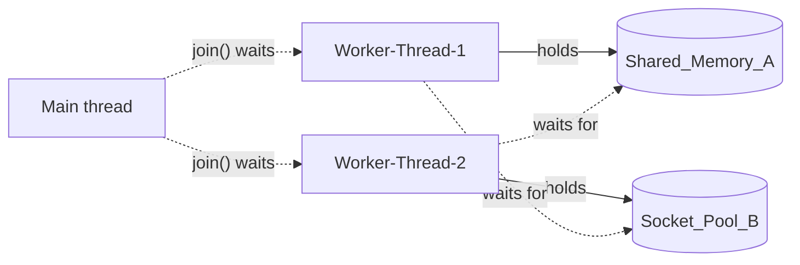

# [Bug] Deadlock - MULTI_THREAD_ENABLE=true에서 두 워커 스레드가 서로의 락을 기다리며 프로세스가 무응답(Hang)

| 항목 | 값 |
|---|---|
| 대상 | `agent-leak-app-arm64` (부모 PID 1464 → 실제 작업 자식 **PID 1475**, 스레드 LWP 1475·1495·1496) |
| 환경 | Ubuntu 24.04 aarch64 컨테이너, 10 vCPU / 8GB, 실행 계정 `agent`(uid 1001) |
| 발생 조건 | `MULTI_THREAD_ENABLE=true`, `MEMORY_LIMIT=512`, `CPU_MAX_OCCUPY=50` |
| 발생 시각 | 2026-10-06 20:29:34 UTC (실행 시작 20:29:24, 마지막 로그 이후 189초간 무응답 관찰) |
| 원본 증거 | [`evidence/deadlock/before/`](../evidence/deadlock/before), [`evidence/deadlock/after/`](../evidence/deadlock/after) |

## 1. Description (현상 설명)

`MULTI_THREAD_ENABLE=true`로 실행하면 부트 시퀀스는 통과한다. 그런데 **실행 10초 뒤부터 로그가 완전히 멈추고, 프로세스는 종료되지 않은 채 PID를 유지한다.** 오류 메시지도, 종료 코드도 남지 않는다. 겉으로 보면 "살아있는" 프로세스라서 OOM이나 CPU 케이스처럼 프로세스가 사라지는 장애보다 알아채기 어렵다.

- 언제: 20:29:34.014 `WAITING ... (Status: BLOCKED)` 두 줄을 끝으로 로그 출력이 멈췄다. 관찰을 끝낸 20:32:43까지 **189초 동안 로그가 한 줄도 늘지 않았다.**
- 어떤 조건에서: 배너가 `[ THREAD ] Concurrency: True [ WARNING ]`, `>>> SYSTEM WARNING: POTENTIAL DEADLOCK IN CONCURRENT MODE.`로 경고했다. 메모리(512MB)와 CPU(50%)는 정상값이다.
- 재현성: 같은 설정으로 2회 실행(정찰 1회, 본 측정 1회)했고 두 번 모두 시작 약 7~10초 뒤 같은 지점에서 멈췄다.

## 2. Evidence & Logs (증거 자료)

진단은 아래 순서로 했다. 각 단계의 결과가 다음 단계에서 무엇을 확인할지를 정했다 ([`scripts/probe_hang.sh`](../scripts/probe_hang.sh)).

### 2-1. ① 살아있는가: `ps -ef | grep` ([probe.txt](../evidence/deadlock/before/probe.txt), 로그가 멈춘 지 95초 뒤)

```
### 0) 시각: 2026-10-06 20:31:05  대상 PID: 1475
agent       1464    1448  0 20:29 ?        00:00:00 ./agent-leak-app-arm64
agent       1475    1464  0 20:29 ?        00:00:00 ./agent-leak-app-arm64
```
→ PID 1475가 존재한다. 크래시가 아니다. 그런데 누적 CPU 시간이 `00:00:00`이므로 "일하고 있는지"를 다음 단계에서 확인했다.

### 2-2. ② CPU/메모리 정체: `monitor.sh` ([monitor.log](../evidence/deadlock/before/monitor.log), 5초 간격 32회)

```
[2026-10-06 20:29:31] PROCESS:agent-leak-app PID:1475 CPU:1% MEM:0.2% RSS:16MB THREADS:3 STAT:SNl ...   ← 워커 시작
[2026-10-06 20:29:37] PROCESS:agent-leak-app PID:1475 CPU:0% MEM:0.2% RSS:16MB THREADS:3 STAT:SNl ...   ← BLOCKED 직후
[2026-10-06 20:30:52] PROCESS:agent-leak-app PID:1475 CPU:0% MEM:0.1% RSS:10MB THREADS:3 STAT:SNl ...
[2026-10-06 20:32:39] PROCESS:agent-leak-app PID:1475 CPU:0% MEM:0.1% RSS:10MB THREADS:3 STAT:SNl ...   ← 관찰 종료 직전
[2026-10-06 20:32:46] PROCESS:agent-leak-app PID:- STATUS:NOT_RUNNING ...                              ← 수동 SIGTERM 후
```

| 구간 | 샘플 수 | CPU | RSS | THREADS / STAT |
|---|---|---|---|---|
| 20:29:37 ~ 20:32:39 (BLOCKED 이후) | 30 | **0% (30회 전부)** | 16 → 12 → 10MB (증가 없음) | 3 / `SNl` 고정 |

- CPU는 BLOCKED 이후 30회 측정 모두 0%였다. 연산을 전혀 하지 않는다.
- RSS는 한 번도 증가하지 않았다. 새 할당이 없는 상태에서 커널이 쓰지 않는 페이지를 회수해 계단식으로 조금 줄었을 뿐이다. OOM 케이스의 선형 증가와 대조된다.
- `STAT SNl`의 뜻: `S`는 interruptible sleep(대기 중), `N`은 nice 상태(우선순위를 낮춤), `l`은 멀티스레드다. 실행 중(`R`)인 스레드가 하나도 없다.

### 2-3. ③ 스레드 단위 확인: `ps -L` + `top -H` (probe.txt)

```
### 2) 스레드별 상태·대기 지점 — ps -L (STAT, WCHAN)
    PID     LWP STAT %CPU %MEM   RSS WCHAN                    TIME COMMAND
   1475    1475 SNl   0.0  0.1 10388 futex_wait           00:00:00 agent-leak-app-
   1475    1495 SNl   0.0  0.1 10388 futex_wait           00:00:00 agent-leak-app-
   1475    1496 SNl   0.0  0.1 10388 futex_wait           00:00:00 agent-leak-app-

### 3) 스레드별 CPU 변화 — top -H (2초 간격 3회)
top - 20:31:05 ...   1495 ... S 0.0 0.1 0:00.00   1496 ... S 0.0 0.1 0:00.00   1475 ... S 0.0 0.1 0:00.03
top - 20:31:07 ...   1495 ... S 0.0 0.1 0:00.00   1496 ... S 0.0 0.1 0:00.00   1475 ... S 0.0 0.1 0:00.03
top - 20:31:09 ...   1495 ... S 0.0 0.1 0:00.00   1496 ... S 0.0 0.1 0:00.00   1475 ... S 0.0 0.1 0:00.03
```
→ 스레드 3개가 **모두 `futex_wait`**에서 잠들어 있다. futex는 리눅스에서 mutex와 lock을 구현하는 커널 기본 기능이다. 즉 3개 스레드가 전부 **락이 풀리기를 기다리고 있다.** 3회 측정 동안 `TIME+`도 전혀 변하지 않았다.

### 2-4. ④ 시간이 지나도 그대로인가: `/proc/<PID>/task/*` 두 시점 비교 ([probe.txt](../evidence/deadlock/before/probe.txt) vs [probe2.txt](../evidence/deadlock/before/probe2.txt))

| LWP | 20:31:09 (멈춘 지 95s) | 20:32:43 (멈춘 지 189s) | 변화 |
|---|---|---|---|
| 1475 (main) | `S futex_wait utime=2 stime=1` | `S futex_wait utime=2 stime=1` | **없음** |
| 1495 (worker) | `S futex_wait utime=0 stime=0` | `S futex_wait utime=0 stime=0` | **없음** |
| 1496 (worker) | `S futex_wait utime=0 stime=0` | `S futex_wait utime=0 stime=0` | **없음** |

→ 94초 동안 어느 스레드도 CPU tick을 1개도 쓰지 않았다. 일시적으로 느린 것이 아니라 **영구 대기**다.

### 2-5. ⑤ 로그는 어디서 멈췄나: 마지막 기록 ([app.log](../evidence/deadlock/before/app.log))

```
### 5) 로그 진행 여부 — 마지막 기록 시각 vs 현재
now : 2026-10-06 20:31:09
mtime: 2026-10-06 20:29:34.014186751 +0000
age : 95s                                  (probe2 시점: age 189s)
```
```
2026-10-06 20:29:26,965 [WARNING] [AgentWorker] Initializing concurrent transaction processors...
2026-10-06 20:29:26,966 [WARNING] [System] CAUTION: Strict resource locking is enabled.
2026-10-06 20:29:31,996 [INFO] [Worker-Thread-1] Process Started. Attempting to lock [Shared_Memory_A]...
2026-10-06 20:29:31,996 [INFO] [AgentWorker][Worker-Thread-2] Process Started. Attempting to lock [Socket_Pool_B]...
2026-10-06 20:29:31,997 [INFO] [AgentWorker] Waiting for worker threads to complete transactions...
2026-10-06 20:29:31,997 [INFO] [AgentWorker][Worker-Thread-1] LOCK ACQUIRED: [Shared_Memory_A]. (Holding...)
2026-10-06 20:29:31,998 [INFO] [AgentWorker][Worker-Thread-2] LOCK ACQUIRED: [Socket_Pool_B]. (Holding...)
2026-10-06 20:29:31,999 [INFO] [AgentWorker][Worker-Thread-1] Processing critical data in Memory A...
2026-10-06 20:29:31,999 [INFO] [AgentWorker][Worker-Thread-2] Establishing network connections in Pool B...
2026-10-06 20:29:34,012 [INFO] [AgentWorker][Worker-Thread-1] Need resource [Socket_Pool_B] to finish job.
2026-10-06 20:29:34,013 [INFO] [AgentWorker][Worker-Thread-2] Need resource [Shared_Memory_A] to write logs.
2026-10-06 20:29:34,013 [INFO] [AgentWorker][Worker-Thread-1] WAITING for [Socket_Pool_B]... (Status: BLOCKED)
2026-10-06 20:29:34,014 [INFO] [AgentWorker][Worker-Thread-2] WAITING for [Shared_Memory_A]... (Status: BLOCKED)
                                                         ← 이후 189초간 기록 없음
```

### 2-6. 종료 처리 (probe2.txt, run.txt)
```
### 6) 종료: 2026-10-06 20:32:43 SIGTERM 전송 (kill -TERM 1475)
SIGTERM 후 3초 내 종료 확인 (pgrep 결과 없음)
END 2026-10-06 20:32:43 EXIT:143 SURVIVED:199s
```
- 데드락 상태여도 SIGTERM으로는 종료됐다. 이 앱은 스스로 Hang을 감지해 빠져나오는 장치(타임아웃, Watchdog)가 없다. 그래서 **사람이나 외부 감시가 kill하기 전까지는 무기한 살아 있는다.**

## 3. Root Cause Analysis (원인 분석)

**결론: 두 워커 스레드가 각자 락 하나를 쥔 채 상대가 쥔 락을 요청하는 순환 대기(Circular Wait)에 빠졌다. 메인 스레드는 두 워커가 끝나기를 기다리므로(join) 함께 멈췄다.**

### 3-1. 로그로 그린 자원 할당 관계

| 스레드 | 보유(Holding) | 요청(Waiting) | 근거 로그 (시각) |
|---|---|---|---|
| Worker-Thread-1 | `Shared_Memory_A` | `Socket_Pool_B` | `LOCK ACQUIRED: [Shared_Memory_A]` (31.997) → `WAITING for [Socket_Pool_B]` (34.013) |
| Worker-Thread-2 | `Socket_Pool_B` | `Shared_Memory_A` | `LOCK ACQUIRED: [Socket_Pool_B]` (31.998) → `WAITING for [Shared_Memory_A]` (34.014) |
| Main (AgentWorker) | - | Worker 1·2 종료(join) | `Waiting for worker threads to complete transactions...` (31.997) |



추적 과정은 다음과 같다. 로그에서 같은 스레드 이름의 `LOCK ACQUIRED`(보유)와 `WAITING for`(요청)를 짝지었고, T1이 기다리는 자원 B의 보유자가 T2이고 T2가 기다리는 자원 A의 보유자가 T1임을 확인했다. **T1 → B → T2 → A → T1**로 고리가 닫힌다. 두 WAITING 로그 이후 해당 락의 `RELEASE`나 다음 단계 로그가 없다는 점, 그리고 OS에서 본 세 스레드가 모두 `futex_wait`(락 대기)라는 점이 이 해석과 맞는다.

### 3-2. 교착상태 4대 조건이 모두 성립

| 조건 | 의미 | 이 장애에서의 근거 |
|---|---|---|
| 상호 배제 (Mutual Exclusion) | 자원은 한 번에 한 스레드만 쓸 수 있다 | `Strict resource locking is enabled`. A와 B는 배타적 lock이라 T2는 A를 공유할 수 없다 |
| 점유 대기 (Hold and Wait) | 자원을 쥔 채 다른 자원을 기다린다 | T1은 A를 `(Holding...)`한 채 B를 `WAITING` 중이고, T2도 마찬가지다 |
| 비선점 (No Preemption) | 남이 쥔 자원을 강제로 뺏을 수 없다 | 락은 보유자가 스스로 release해야 풀린다. 타임아웃이 없어 189초 동안 아무도 놓지 않았다 |
| 순환 대기 (Circular Wait) | 대기 관계가 원을 이룬다 | T1 → B(T2 보유), T2 → A(T1 보유) |

네 조건 중 **하나라도 깨면** 교착상태는 생기지 않는다. 가장 현실적인 해법은 순환 대기를 깨는 것으로, 4절에서 다룬다.

### 3-3. 관련 OS 동작 원리
- **식사하는 철학자 문제**와 같은 구조다. 철학자 2명(T1, T2)이 각자 왼쪽 포크(A 또는 B)를 집은 뒤 오른쪽 포크를 기다리면, 아무도 먹지 못하고 영원히 기다린다.
- 락을 얻지 못한 스레드는 바쁘게 재시도(spin)하지 않는다. 커널 `futex_wait`에서 **잠들고(S 상태)** 스케줄러 런큐에서 빠진다. 그래서 CPU는 0%이고, 새 할당이 없으니 메모리도 변하지 않는다. 즉 데드락은 **자원을 소모하지 않는 장애**라서 CPU나 메모리 임계치 기반 관제로는 잡히지 않는다. 로그 진행 여부(heartbeat)를 봐야 찾을 수 있다.
- OOM과 CPU 케이스에는 앱 내부 보호 장치(MemoryGuard, Watchdog)가 있었지만, 데드락에는 없었다. 결과적으로 장애 중 가장 오래 감지되지 않은 채 요청을 계속 받지 못하는 상태로 남는다.

## 4. Workaround & Verification (조치 및 검증)

### 조치
`MULTI_THREAD_ENABLE`을 **true → false**로 변경했다. 동시에 락을 잡는 워커 구성을 끄는 것이다.
```bash
CASE=deadlock TAG=after MULTI_THREAD_ENABLE=false MEMORY_LIMIT=512 CPU_MAX_OCCUPY=50 scripts/run.sh
```

### Before & After

| 항목 | Before (`true`) | After (`false`) |
|---|---|---|
| 선택된 시나리오 | 동시 트랜잭션 처리 (`POTENTIAL DEADLOCK` 경고) | `Scenario Selected: [Healthy System Monitoring]` |
| PID 존재 | 존재 (1475) | 존재 (2209) |
| 로그 진행 | **20:29:34 이후 189초간 0줄** (age 95s → 189s) | 204초 동안 app.log **198줄**, 마지막 기록 age **1~2s** |
| `BLOCKED` 로그 | 2건 | **0건** |
| 스레드 대기 지점 | 3개 모두 `futex_wait` | main `futex_wait`(join, 정상), worker 2개 `do_select`(sleep 후 깨어나 작업) |
| 스레드 utime 변화 (두 시점) | 1495: 0→0, 1496: 0→0 (**정지**) | 2210: 10→20, 2211: 95→188 (**진행**) |
| 종료 | 수동 SIGTERM 전까지 Hang | 수동 SIGTERM 전까지 정상 동작 |

After의 두 시점 측정 ([probe.txt](../evidence/deadlock/after/probe.txt) → [probe2.txt](../evidence/deadlock/after/probe2.txt)):
```
20:35:01  2210 state=S wchan=do_select utime=10 stime=46   |  20:36:40  2210 state=S wchan=do_select utime=20 stime=86
20:35:01  2211 state=S wchan=do_select utime=95 stime=1    |  20:36:40  2211 state=S wchan=do_select utime=188 stime=2
          mtime age: 2s                                    |            mtime age: 1s
```

**검증 결과**: `false`로 바꾸자 데드락이 재현되지 않았다. 로그가 계속 진행됐고(`Scheduler All tasks completed`, `Memory Cache Flushed` 3회 등), 워커 스레드가 CPU tick을 계속 소비하며 작업했다. 같은 상태 `S`여도 Before는 **락 대기(`futex_wait`)**, After는 **타이머 대기(`do_select`, `time.sleep`)**였다. `wchan`으로 "막힌 대기"와 "쉬는 대기"를 구분할 수 있었다.

### 한계와 근본 해결 제안
- 멀티스레드를 끄는 것은 **동시성을 포기하는 임시 조치**다. 처리량이 줄어든다.
- 코드 수정 제안 (순환 대기 또는 비선점 조건 깨기):
  1. **락 획득 순서를 전역으로 고정**한다. 모든 스레드가 항상 `Shared_Memory_A → Socket_Pool_B` 순서로 잡게 하면 순환이 생길 수 없다. 가장 단순하고 효과적이다.
  2. `lock.acquire(timeout=…)`으로 일정 시간 안에 못 얻으면 **보유 락을 모두 놓고 재시도**한다(비선점 조건 깨기, 백오프 포함).
  3. 두 자원을 함께 써야 하는 작업이라면 락을 하나로 합치거나, 필요한 락을 한 번에 모두 얻는(all-or-nothing) 방식을 쓴다(점유 대기 조건 깨기).
- 운영 제안: 로그 heartbeat(`agent_app.log` mtime 경과 시간)가 N초를 넘으면 경보한다. 경보가 오면 `ps -L`의 `wchan`과 스레드 덤프(Python `faulthandler.dump_traceback_later`)로 자동 진단한다.
