# [Analysis] 로그 패턴 분석을 통한 스케줄링 알고리즘 추론 — Round-Robin (퀀텀 ≈ 작업 2단계, 약 110ms)

| 항목 | 값 |
|---|---|
| 대상 | `agent-leak-app`의 Healthy 시나리오(`MEMORY_LIMIT=512`, `CPU_MAX_OCCUPY=50`, `MULTI_THREAD_ENABLE=false`) 시작 시 `[Scheduler]` 구간 |
| 표본 | 독립 실행 4회 ([recon/app-3](../evidence/recon/app-3-mem512-cpu50.log), [oom/after](../evidence/oom/after/app.log), [cpu/after](../evidence/cpu/after/app.log), [deadlock/after](../evidence/deadlock/after/app.log)) |
| 분석 도구 | [`scripts/sched_segments.sh`](../scripts/sched_segments.sh): 같은 스레드의 연속 로그를 한 실행 구간(segment)으로 묶어 순서, 구간 길이, 진행률을 계산한다 (POSIX awk) |
| 결과 원본 | [`evidence/sched/segments.txt`](../evidence/sched/segments.txt) |

## 1. 로그 관찰 개요

Healthy 시나리오가 시작되면 `[Scheduler]`가 작업 3개를 등록하고 실행한다.
```
2026-10-06 20:06:46,903 [INFO] >>> Scenario Selected: [Healthy System Monitoring]
2026-10-06 20:06:46,905 [INFO] [Scheduler] Task Scheduler Initialized.
2026-10-06 20:06:46,906 [INFO] [Scheduler] Registered Tasks: ['Thread-A', 'Thread-B', 'Thread-C']
2026-10-06 20:06:46,906 [INFO] [Scheduler] Starting task execution...
```
각 작업은 진행률 20% → 40% → 60% → 80% → 100%의 **5단계**로 이뤄져 있다. 로그의 타임스탬프(ms)와 진행률, 그리고 `Preempted`/`Resumed` 키워드를 근거로 실행 순서와 교체 주기를 패턴화했다.

## 2. 증거 자료

### 2-1. Application Log Snapshot (표본 1, [recon/app-3](../evidence/recon/app-3-mem512-cpu50.log))
```
2026-10-06 20:06:46,906 [INFO] [Thread-A] Task Started. Calculating... (20%)
2026-10-06 20:06:46,962 [INFO] [Thread-A] Calculating... (40%)
2026-10-06 20:06:47,018 [INFO] [Thread-A] Preempted. Progress saved at (40%)      <-- A 중단 (40%에서)
2026-10-06 20:06:47,072 [INFO] [Thread-B] Task Started. Calculating... (20%)      <-- B 시작
2026-10-06 20:06:47,123 [INFO] [Thread-B] Calculating... (40%)
2026-10-06 20:06:47,179 [INFO] [Thread-B] Preempted. Progress saved at (40%)      <-- B 중단
2026-10-06 20:06:47,234 [INFO] [Thread-C] Task Started. Calculating... (20%)      <-- C 시작
2026-10-06 20:06:47,288 [INFO] [Thread-C] Calculating... (40%)
2026-10-06 20:06:47,343 [INFO] [Thread-C] Preempted. Progress saved at (40%)      <-- C 중단
2026-10-06 20:06:47,397 [INFO] [Thread-A] Resumed. Calculating... (60%)           <-- A 재개 (저장된 40% 다음부터)
2026-10-06 20:06:47,452 [INFO] [Thread-A] Calculating... (80%)
2026-10-06 20:06:47,508 [INFO] [Thread-A] Preempted. Progress saved at (80%)
2026-10-06 20:06:47,564 [INFO] [Thread-B] Resumed. Calculating... (60%)
   ... (B, C 동일)
2026-10-06 20:06:47,892 [INFO] [Thread-A] Resumed. Calculating... (100%)          <-- 남은 1단계만 실행하고 완료
2026-10-06 20:06:47,946 [INFO] [Thread-B] Resumed. Calculating... (100%)
2026-10-06 20:06:48,002 [INFO] [Thread-C] Resumed. Calculating... (100%)
2026-10-06 20:06:48,059 [INFO] [Scheduler] All tasks completed.
```

### 2-2. 구간 분석 결과 (`sched_segments.sh` 출력, 표본 1)
```
#1 Thread-A start=20:06:46,906 span=112ms lines=3 progress=20%→40% last="Preempted. Progress saved at (40%)"
#2 Thread-B start=20:06:47,072 span=107ms lines=3 progress=20%→40% last="Preempted. Progress saved at (40%)"
#3 Thread-C start=20:06:47,234 span=109ms lines=3 progress=20%→40% last="Preempted. Progress saved at (40%)"
#4 Thread-A start=20:06:47,397 span=111ms lines=3 progress=60%→80% last="Preempted. Progress saved at (80%)"
#5 Thread-B start=20:06:47,564 span=112ms lines=3 progress=60%→80% last="Preempted. Progress saved at (80%)"
#6 Thread-C start=20:06:47,730 span=106ms lines=3 progress=60%→80% last="Preempted. Progress saved at (80%)"
#7 Thread-A start=20:06:47,892 span=0ms lines=1 progress=100%→100% last="Resumed. Calculating... (100%)"
#8 Thread-B start=20:06:47,946 span=0ms lines=1 progress=100%→100% last="Resumed. Calculating... (100%)"
#9 Thread-C start=20:06:48,002 span=0ms lines=1 progress=100%→100% last="Resumed. Calculating... (100%)"
segments=9 switches=8 avg_slice=137.0ms (구간 시작 간격 평균)
```

### 2-3. 실행 타임라인 (표본 1, 단위 ms, 46.906 기준)

```mermaid
gantt
  title Scheduler 실행 순서 (표본 1) — 막대 = 구간 시작부터 다음 구간 시작까지(실행 + 교체)
  dateFormat x
  axisFormat %L
  section Thread-A
  20→40% (Preempted) :a1, 0, 166
  60→80% (Preempted) :a2, 491, 167
  100% 완료          :a3, 986, 54
  section Thread-B
  20→40% (Preempted) :b1, 166, 162
  60→80% (Preempted) :b2, 658, 166
  100% 완료          :b3, 1040, 56
  section Thread-C
  20→40% (Preempted) :c1, 328, 163
  60→80% (Preempted) :c2, 824, 162
  100% 완료          :c3, 1096, 57
```



### 2-4. 재현성: 4개 표본 비교 ([segments.txt](../evidence/sched/segments.txt))

| 표본 | 구간 수 | 실행 순서 | 진행률 패턴 (구간별) |
|---|---|---|---|
| recon/app-3 | 9 | A B C A B C A B C | 2단계, 2단계, 1단계(완료) |
| oom/after | 9 | A B C A B C A B C | 동일 |
| cpu/after | 9 | A B C A B C A B C | 동일 |
| deadlock/after | 9 | A B C A B C A B C | 동일 |

| 지표 (4개 표본 합산) | 값 |
|---|---|
| 일반 구간(#1~#6)의 실행 길이(span) 평균 | **109.4ms** (n=24) |
| 일반 구간의 시작 간격(다음 구간 시작까지) 평균 | **163.2ms** (n=24) |
| 마지막 구간(#7~#9, 완료)의 시작 간격 평균 | **55.5ms** (n=8) |
| 작업 1단계(20% → 40% 등) 소요 | 약 55ms |

위 표의 집계 명령 (원본 `segments.txt`에서 다시 계산):
```bash
awk '/^===/{next} /^#/{split($3,a,/[=:,]/); t=((a[2]*60+a[3])*60+a[4])*1000+a[5]; n=substr($1,2); if(n>1){g=t-p; if(n<=7){F+=g;nf++} else {L+=g;nl++}} p=t; if(n<=6){split($4,s,/[=m]/); S+=s[2]; ns++}} END{printf "span %.1fms (n=%d) / gap %.1fms (n=%d) / final %.1fms (n=%d)\n",S/ns,ns,F/nf,nf,L/nl,nl}' evidence/sched/segments.txt
# → span 109.4ms (n=24) / gap 163.2ms (n=24) / final 55.5ms (n=8)
```

## 3. 패턴 분석 및 결론

세 후보를 각각 반증하거나 지지하는 증거로 하나씩 걸러냈다.

| 후보 | 이 알고리즘이라면 기대되는 로그 | 실제 관찰 | 판정 |
|---|---|---|---|
| **FCFS** (선착순, 비선점) | A가 20→100%를 **끝까지** 마친 뒤에야 B가 시작한다 | A가 **40%에서 `Preempted`**되고 B가 시작된다(47.018 → 47.072) | **배제** |
| **Priority** (우선순위) | 높은 우선순위 작업이 먼저, 더 길게 실행된다. 우선순위가 낮은 작업은 기다리거나 기아(starvation)에 빠진다 | 세 작업이 **같은 길이(약 110ms, 2단계)**를 **등록 순서 A→B→C 그대로 고정 순환**하며 받는다. 4회 실행 모두 같다 | **배제** (모든 작업이 같은 우선순위라고 보더라도, 그러면 FIFO 순환이 되어 RR과 같은 결과가 된다) |
| **Round-Robin** (시간 할당량 순환) | 각 작업이 정해진 퀀텀만큼 실행되고, 끝나지 않으면 선점돼 **준비 큐 맨 뒤**로 간다. 남은 작업량이 퀀텀보다 적으면 **일찍 끝내고 양보**한다 | ① 퀀텀이 일정하다(2단계, 약 110ms) ② 선점 후 `Progress saved` → 다음 차례에 `Resumed`로 저장 지점부터 이어 실행(**문맥 저장/복원**) ③ A→B→C→A 고정 순환 ④ 마지막 라운드는 남은 1단계만 실행하고 완료해 구간이 짧아진다(163ms → 55ms) | **채택** |

**최종 결론**: 이 프로그램의 Scheduler는 **퀀텀이 약 작업 2단계(실행 약 110ms, 교체 포함 약 163ms)인 Round-Robin**으로 작업을 처리한다.
- 작업당 5단계를 퀀텀 2로 나누면 2 + 2 + 1이다. 그래서 작업마다 구간이 3개(총 9개)이고, 마지막 구간만 짧다. 계산과 관찰이 정확히 맞는다.
- 문맥 교환 비용 추정: 구간 시작 간격(163ms)에서 실행 길이(109ms)를 빼면 약 54ms가 `Preempted` 기록부터 다음 작업 시작까지 걸리는 시간이다. 이번 로그에서는 작업 1단계와 비슷한 크기다.

## 4. 장단점 및 적합한 아키텍처

### Round-Robin의 기술적 장단점

| 장점 | 단점 |
|---|---|
| **응답성**: 어떤 작업도 최대 (n−1)×퀀텀 안에 CPU를 다시 받는다. 여기서는 2 × 163ms ≈ 0.33s다. 긴 작업이 짧은 작업을 막는 convoy effect가 없다 | **문맥 교환 오버헤드**: 이번 관찰에서 교체 비용(약 54ms)이 실행 시간(약 110ms)의 절반 수준이었다. 퀀텀이 작을수록 오버헤드 비율이 커진다 |
| **공정성과 기아 없음**: 모든 작업이 같은 몫을 순서대로 받는다 | **평균 반환 시간(turnaround)이 길다**: 모든 작업이 끝까지 서로 끼어들어, 셋 다 마지막 라운드에 몰려 끝난다(A 47.892, B 47.946, C 48.002). FCFS였다면 A는 약 0.3초 만에 끝났을 것이다 |
| **예측 가능성**: 퀀텀과 작업 수만 알면 최악 대기 시간을 계산할 수 있다 | **우선순위 표현 불가**: 급한 작업도 자기 차례를 기다려야 한다 |
| 구현이 단순하다 (FIFO 큐 + 타이머) | **퀀텀 선택이 어렵다**: 너무 크면 FCFS처럼 되고, 너무 작으면 교체 비용이 대부분을 차지한다 |

### 어떤 서비스에 적합한가

| 서비스 성격 | 적합한 알고리즘 | 이유 |
|---|---|---|
| **실시간 응답이 중요한 웹/API 서버, 대화형 시스템** | **Round-Robin** (또는 이를 발전시킨 MLFQ, CFS) | 요청마다 짧은 응답 지연이 중요하다. 무거운 요청 하나가 다른 사용자 요청을 막지 않아야 한다 |
| 처리량이 중요한 **배치 서버** (ETL, 대량 리포트 생성) | FCFS / SJF | 작업 사이에 교체할 필요가 없어 문맥 교환 비용이 최소이고 캐시 지역성이 좋다. 전체 완료 시간과 처리량이 핵심이다 |
| 마감 시한이 있는 작업이 섞인 시스템 (결제, 알림, 장애 대응) | Priority (+ aging으로 기아 방지) | 중요한 작업을 먼저 처리해야 한다 |

이 앱은 "Agent"로서 업로드 처리, 관제, 키 검증 같은 **여러 작업을 동시에 조금씩 진행시키며 응답성을 유지**해야 하므로 RR이 맞는 선택이다. 다만 관찰된 교체 비용 비율(약 33%)을 보면 퀀텀을 늘릴 여지가 있다.

## 5. 한계
- 관찰한 것은 앱이 로그로 남긴 **애플리케이션 수준 스케줄러**의 동작이다. OS 커널 스케줄러(리눅스 CFS)의 동작이 아니다. Healthy 모드에서 OS는 스레드 3개를 보여 줬지만(`THREADS:3`), 로그상으로는 항상 한 작업만 진행됐고 4회 모두 같은 순서와 같은 구간 구조(실행 길이 105~116ms)였다. 이는 앱 내부 로직이 순서를 결정한다는 뜻이다. (참고: CPython은 GIL 때문에 한 번에 한 스레드만 바이트코드를 실행하고, 기본 전환 간격은 `sys.getswitchinterval()` = 5ms다. 관찰된 약 110ms 퀀텀은 이것과 다르므로 GIL 전환이 아니라 앱 스케줄러의 정책으로 본다.)
- 바이너리 디컴파일이 금지돼 있으므로, 결론은 로그 타임스탬프에서 **역추론**한 것이다.
